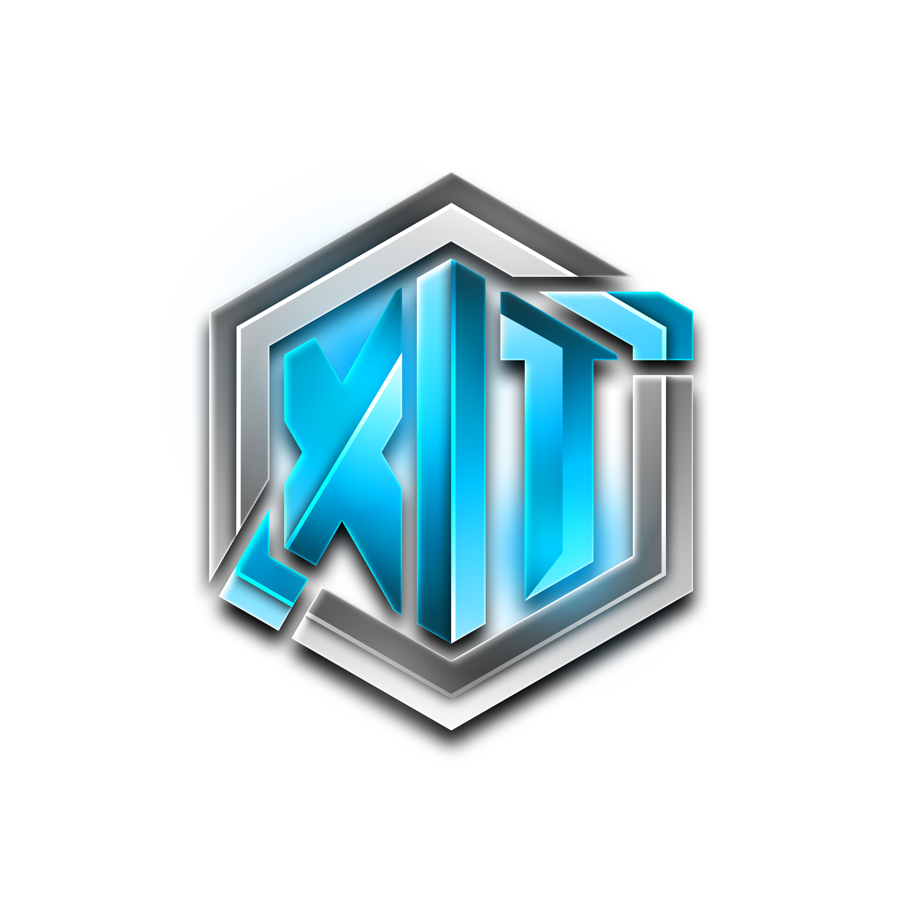

# Xtream-ITSolutions

### Managed Infrastructure · Cloud · Software Engineering

Wir unterstützen Unternehmen, Start-ups und Entwickler beim Aufbau und Betrieb moderner, sicherer IT-Lösungen – von der Infrastruktur bis zur individuellen Software.

 

  

---

## Inhaltsübersicht

- [Was wir machen](#was-wir-machen)
- [Leistungsbereiche](#leistungsbereiche)
- [Technische Schwerpunkte](#technische-schwerpunkte)
- [Wie wir arbeiten](#wie-wir-arbeiten)
- [Produkt- und Projektentwicklung](#produkt--und-projektentwicklung)
- [Technologien](#technologien)
- [Kontakt](#kontakt)

## Was wir machen

Xtream-ITSolutions UG (haftungsbeschränkt) entwickelt und betreibt digitale Lösungen für Kunden, die zuverlässige Infrastruktur und technische Umsetzung aus einer Hand suchen. Unser Schwerpunkt liegt auf nachvollziehbarem Betrieb, klarer Kommunikation und Lösungen, die langfristig wartbar bleiben.

Wir verbinden **Softwareentwicklung, Infrastruktur und Betrieb**. Dadurch können technische Entscheidungen nicht nur implementiert, sondern auch unter realen Betriebsbedingungen bewertet und weiterentwickelt werden.

## Leistungsbereiche

| Bereich | Typische Aufgaben | Ergebnis |
|---|---|---|
| **Managed Hosting** | Webhosting, VPS, dedizierte Server, Domains und SSL | Stabiler und nachvollziehbarer Betrieb |
| **Software Engineering** | Web-Apps, APIs, Automationen, Bots und Integrationen | Wartbare, dokumentierte Software |
| **Security & DevOps** | Docker, CI/CD, Monitoring, Backups und Hardening | Reproduzierbare Deployments und geringere Betriebsrisiken |
| **IT-Consulting** | Architektur, Migration, Digitalisierung und technische Projektbegleitung | Klare Entscheidungen und umsetzbare Roadmaps |

## Technische Schwerpunkte

### Plattformen und Webanwendungen

- Moderne Webanwendungen mit React, Next.js, Vue und TypeScript
- Backend- und API-Entwicklung mit Node.js, PHP/Laravel und Python
- Authentifizierung, Rollenmodelle, Integrationen und automatisierte Abläufe
- Responsive Oberflächen mit Fokus auf verständliche Nutzerführung

### Infrastruktur und Betrieb

- Containerisierte Anwendungen mit Docker und Kubernetes
- Linux-basierter Betrieb, DNS, TLS, Reverse Proxies und Netzwerkkonzepte
- CI/CD-Pipelines für reproduzierbare Builds und Deployments
- Monitoring, Backups, Logging und dokumentierte Betriebsabläufe

### Sicherheit und Qualität

- Prinzipien der minimalen Berechtigung und getrennte Umgebungen
- Secret- und Konfigurationsmanagement ohne Zugangsdaten im Repository
- Abhängigkeiten, Updates und externe Schnittstellen im Blick behalten
- Technische Entscheidungen nachvollziehbar dokumentieren

> Verfügbarkeiten, Reaktionszeiten und Supportumfang richten sich nach dem jeweils vereinbarten Leistungsumfang beziehungsweise SLA.

## Für wen wir arbeiten

Unsere Leistungen richten sich insbesondere an kleine und mittlere Unternehmen, Start-ups, Agenturen, Entwicklerteams und Betreiber digitaler Plattformen. Wir übernehmen sowohl klar abgegrenzte Entwicklungsaufgaben als auch die technische Betreuung laufender Systeme.

## Wie wir arbeiten

| Phase | Inhalt |
|:---:|---|
| **1. Verstehen** | Ziele, bestehende Systeme, Risiken und Prioritäten gemeinsam klären |
| **2. Planen** | Technische Optionen vergleichen und einen realistischen Umfang festlegen |
| **3. Umsetzen** | In nachvollziehbaren Schritten entwickeln, testen und dokumentieren |
| **4. Betreiben** | Übergabe, Monitoring, Wartung und Weiterentwicklung passend zum Bedarf |

Wir starten gerne mit einem kleinen, klar abgegrenzten ersten Schritt. So werden technische Annahmen früh geprüft, bevor größere Investitionen entstehen.

## Produkt- und Projektentwicklung

Ein Teil unserer Arbeit entsteht als interne oder kundenspezifische Software und ist deshalb nicht öffentlich einsehbar. Das betrifft beispielsweise Plattformen, Automationen, Infrastrukturwerkzeuge und Integrationen. Öffentliche Repositorys bilden daher nur einen Ausschnitt unserer technischen Arbeit ab.

Für passende Anfragen zeigen wir gerne relevante Arbeitsproben, technische Konzepte oder eine individuelle Demo. Dabei klären wir vorab, welche Informationen vertraulich bleiben müssen.

## Technologien

### Frontend & Design

### Backend & Daten

### Infrastruktur & Betrieb

## Aktuelle Schwerpunkte

- Ausbau und Dokumentation moderner Container- und Kubernetes-Infrastrukturen
- Weiterentwicklung von Webplattformen und TypeScript-Anwendungen
- Automatisierte Deployments, Monitoring und sichere Betriebsprozesse
- Praktische KI-Integrationen für Support und interne Abläufe
- Self-Service- und API-Funktionen für Kunden und Entwickler

## GitHub-Aktivität

Unsere aktuelle Arbeit, Repositories und technischen Änderungen findest du direkt auf GitHub. Wir verzichten bewusst auf externe Statistik-Karten, damit das Profil auch bei Rate-Limits und Ausfällen externer Bilddienste vollständig nutzbar bleibt.

## Kontakt

Du planst ein IT-, Hosting- oder Softwareprojekt? Schick uns am besten:

- eine kurze Beschreibung des Vorhabens oder Problems,
- den gewünschten Zeitrahmen,
- vorhandene Systeme oder technische Rahmenbedingungen,
- und – falls bekannt – das gewünschte Ergebnis.

Wir klären gemeinsam Anforderungen, technische Optionen und den passenden nächsten Schritt.

  

© 2024–2026 Xtream-ITSolutions UG (haftungsbeschränkt) · Deutschland

